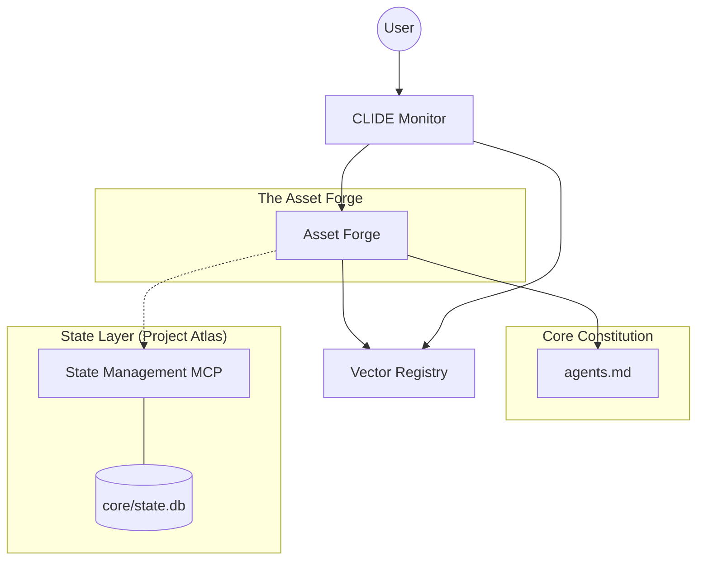
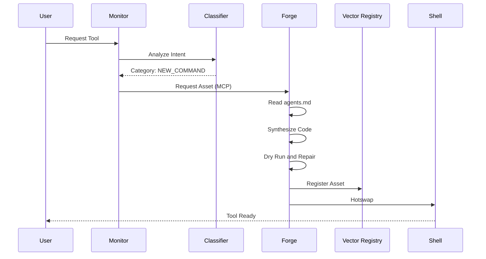
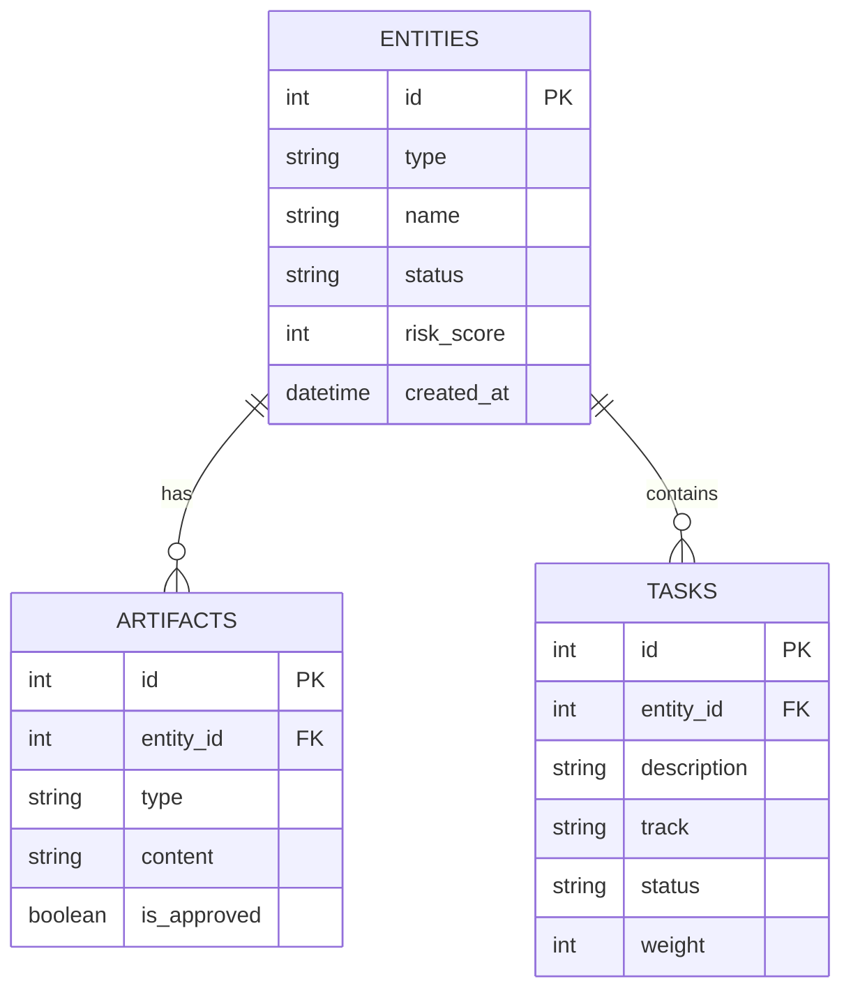

# CLIDE Architecture Visualizations (v0.6.0)

## 1. System Architecture (Component Map)
This diagram illustrates the separation of concerns between the Observer (Monitor), the Forge (Synthesis), and the State Layer.

## 2. Data Flow: From Intent to Artifact
This diagram shows the lifecycle of a user request—from raw text to a saved, hotswapped tool.

## 3. Database Schema (Project Atlas)
The internal structure of `core/state.db`, managed by the `state_manager` MCP.

## 4. ASCII Architecture (Text-Only Fallback)

### A. System Map
[ User ]
   | (Shell / Chat)
   v
[ CLIDE Monitor ]  <-- (Analyzes Intent)
   |
   +--> [ Asset Forge ]
   |       |
   |       +--> (Reads) --> [ Core: agents.md ]
   |       +--> (Synthesizes) --> [ Assets: TOML / MCP ]
   |
   +--> [ Registry ] (Search / Discovery)

[ State Layer ]
   |
   +--> [ State Management MCP ] <--> [ core/state.db (SQLite) ]
           ^            ^
           |            |
      (Tool Call)  (Tool Call)
           |            |
      [ Dev Agent ] [ Bug Agent ]

### B. Data Flow
1. User: "Create a scanner"
2. Monitor: "Intent = NEW_COMMAND"
3. Forge: Synthesizes Code + Constitution
4. Forge: Saves to 'commands/' & Registers
5. Shell: Hotswaps new command
6. User: "Run scanner" -> IT WORKS.

### C. Database Schema
[ ENTITIES ]
+ id (PK)
+ type (FEATURE/BUG)
+ name
+ risk_score
+ status
      |
      +---< [ ARTIFACTS ]
      |     + id
      |     + type (RSD/STORY)
      |     + content
      |     + is_approved
      |
      +---< [ TASKS ]
            + id
            + description
            + track (CODE/DOCS)
            + status
