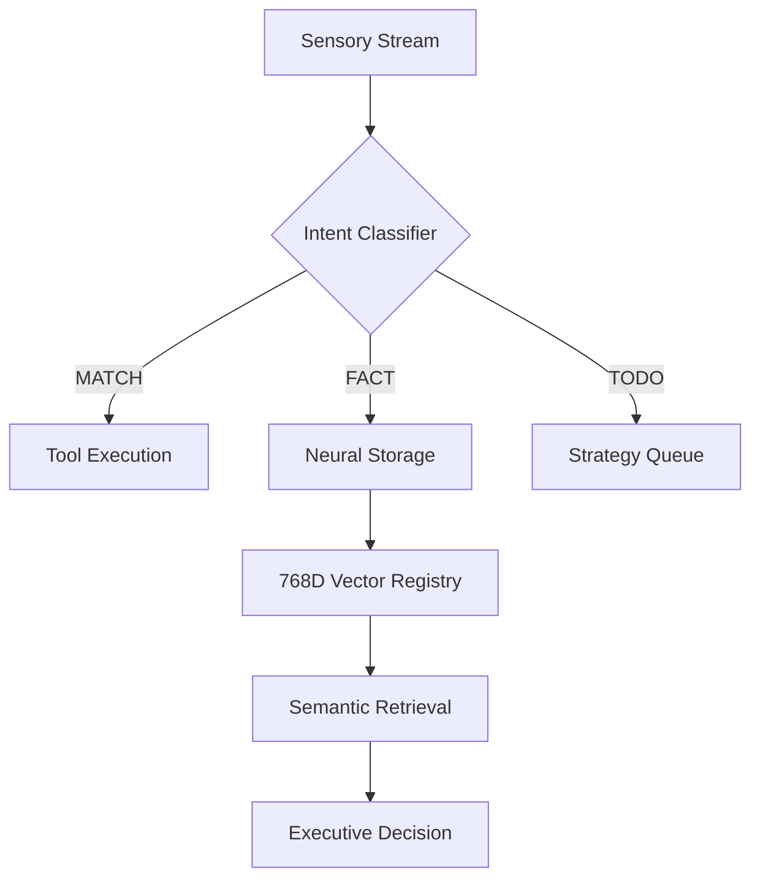

# [ SECTOR 02: COGNITIVE ] - BRAIN
The core processing unit for retroactive analysis, executive summaries, and fact verification.

The `brain` domain provides high-order cognitive functions for the system knowledge base.

<card>
title: ⦗ BRAIN OVERVIEW ⦘
Core: LLM-Driven Synthesis
Functions: Analysis, Summary, Verification
Intelligence: Gemini-1.5-Pro
Status: ONLINE
</card>

### Commands
*   **analyze**: Performs retroactive deep-context processing on recent ingestion data.
*   **summary**: Generates executive reports and multi-session summaries.
*   **verify**: Validates facts against source lineages and cross-references.
*   **approve**: Approves all pending ingestion suggestions (PROPOSALS) and formalizes them into permanent brain nodes.

### Technical Specifications
The Brain uses RAG (Retrieval-Augmented Generation) architectures for high-fidelity responses.

<card>
title: ⦗ OPERATIONAL CONTEXT ⦘
Processing: Async/Batch
Context Window: 128k - 1M Tokens
Precision: High (Temperature 0.1)
</card>

### Usage Examples
1. Deep Analysis: `./cli brain analyze`
2. Session Summary: `./cli brain summary`
3. Fact Check: `./cli brain verify`
4. Batch Approval: `./cli brain approve`

## Cognitive Architecture

### Architecture Internals
The `brain` operates as an orchestrator between the `Vector Registry` and the `LLM Gateway`.

<card>
title: ⦗ NEURAL-KERNEL HOOKS ⦘
Reason Hook: clide.brain.reason.classify_intent
Theory Hook: clide.brain.theory.apply_protocol
Network Hook: clide.brain.network.query
</card>

### API Hooks
*   `atlas.run_deep_analysis()`: Global cognitive update.
*   `atlas.generate_brain_summary()`: RAG-based reporting.

### Code Reference
- **Entry Point**: `clide/serve/portal.py` -> `cmd_brain`
- **Implementation**: `clide/brain/`
- **TUI/Viz**: `clide/serve/atlas.py`